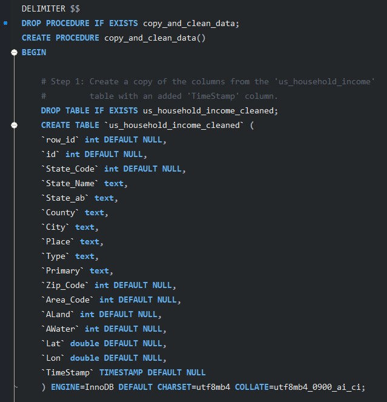
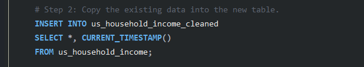
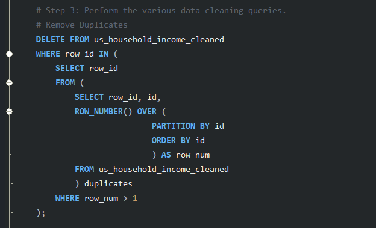
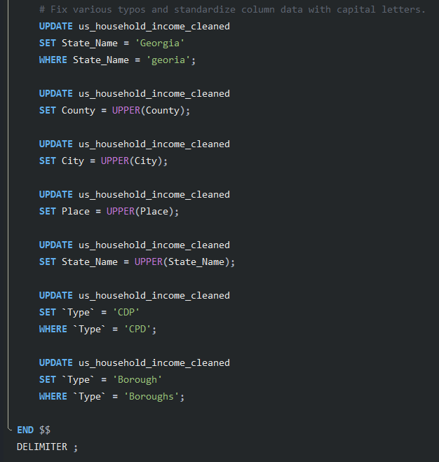
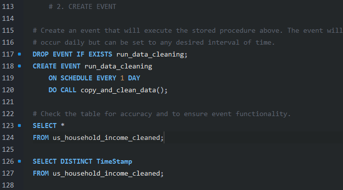

# SQL Project: Automated Data Cleaning

### US Income Data Cleaning

#### by Alex Melino

#

### Background and Data Information

This is a sample project intended to showcase advanced SQL data cleaning skills featuring automation. This dataset uses real data and is provided by [AnalystBuilder.com](https://www.analystbuilder.com/) via the US Government. 

The SQL queries are contained within the main directory of this repo under the file name 'queries.sql'. Automation is acheived using a stored procedure and an event. Additionally, the original data file is titled  'USHouseholdIncome.csv' and it is located in the 'Resources' folder, while the cleaned data is titled 'us_household_income_cleaned.csv' and it is located in the main repository directory.

#

### Data Cleaning with Stored Procedure

The complexity within this data-cleaning task is found with the stored procedure, which makes up a large portion of the overall .sql file. The procedure is titled 'copy_and_clean_data()'. 

The stored procedure is comprised of three steps that will execute in order. The stored procedure is first initialized and then step 1 creates a copy of the original table data but with one added column called 'TimeStamp' which is populated with a timestamp everytime the procedure is run. The code is as follows:

The second part of the stored procedure is to copy the existing data from the original data into the new table that was just created. It also creates the 'CURRENT_TIMESTAMP' variable column: 

The final and largest part of the stored procedure carries out the various data-cleaning queries. In this case, the queries consist of removing duplicates, fixing typos, and standardizing column formats (capitaliziation).

#

### Event for Execution

In the case of data that is updated frequently, an event works well to automate the data cleaning task. In this case, an event was created to run this stored procedure daily. If the data is updated, it will be cleaned on a daily basis without the need for an analyst to re-write any code:

